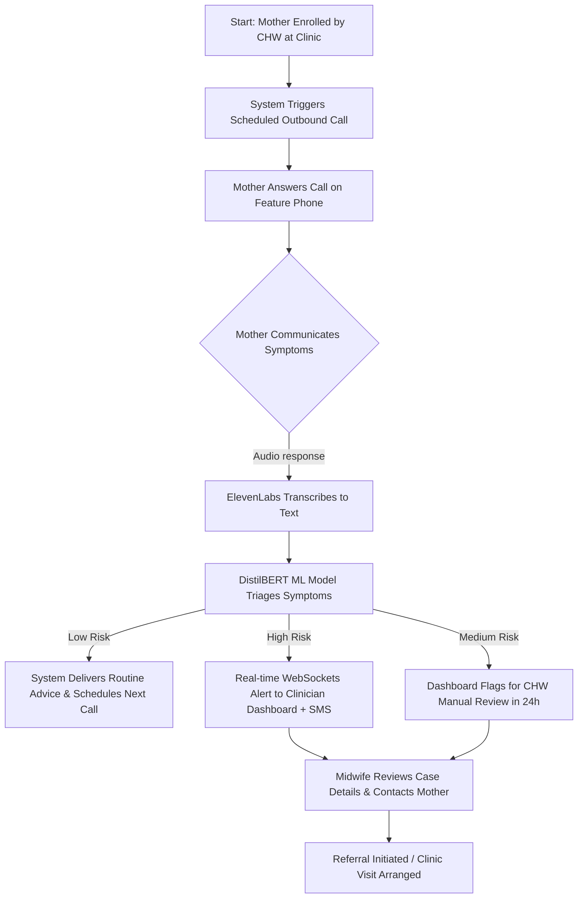
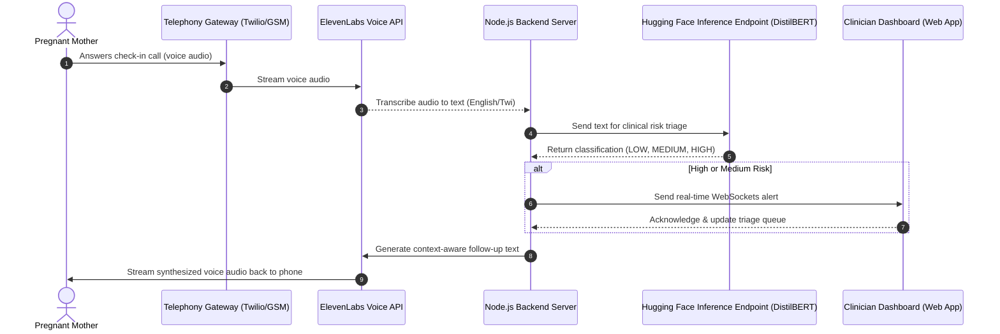

# **TECHNICAL REPORT: MAMACARE AI**
### **Harnessing Artificial Intelligence to Advance Maternal & Sexual Reproductive Health Across the Continent**

**Challenge Track**: Track I: Access to Comprehensive Early Pregnancy Loss Care  
**Context Focus**: Sub-Saharan Africa | Multilingual | Open Science  
**Authors/Team**: MamaCare AI Development Team  

---

# **SECTION A: PROBLEM STATEMENT**

## 1. Challenge Track & Reproductive Health Focus
MamaCare AI is specifically developed for the **AI for Reproductive Health in Africa Innovation Challenge (HASH)** under **Track I: Access to Comprehensive Early Pregnancy Loss Care**. 

Early pregnancy loss (miscarriage and stillbirth) is one of the most neglected areas of reproductive healthcare in Sub-Saharan Africa. The physical and psychological trauma associated with pregnancy loss is compounded by a systemic lack of follow-up care. While standard antenatal protocols focus primarily on viable pregnancies, mothers who experience a loss are often discharged without structured clinical monitoring, leaving them vulnerable to life-threatening post-loss complications (such as sepsis, hemorrhage, and severe depression). MamaCare AI addresses this critical gap by providing continuous, voice-based diagnostic screening and emotional follow-up, ensuring that no mother is left to recover in isolation.

## 2. Target Users & Beneficiaries
The primary target users and beneficiaries of MamaCare AI are:
*   **Pregnant and Post-Loss Mothers**: Specifically those residing in low-resource, rural, and peri-urban communities across Sub-Saharan Africa. These mothers typically rely on basic feature phones, have limited or no mobile data connectivity, and may communicate primarily in local dialects rather than English.
*   **Community Health Workers (CHWs) & Midwives**: Frontline health workers who manage massive patient caseloads (often 200–400 patients per nurse) with paper-based systems. MamaCare AI acts as a triaging copilot, prioritizing their daily follow-up queue.
*   **District Health Administrators**: Managers who require aggregate, real-time data on maternal outcomes and referral compliance to allocate scarce resources.

## 3. Relevance to Sub-Saharan African Contexts
Maternal mortality in Sub-Saharan Africa remains a pressing humanitarian crisis, accounting for approximately 70% of all global maternal deaths. The maternal mortality ratio in West Africa stands at roughly 542 deaths per 100,000 live births, compared to fewer than 10 in high-income regions. Over 75% of these deaths are preventable with timely intervention.

Traditional digital health solutions rely heavily on smartphone applications or high-bandwidth internet connectivity. However, across rural Sub-Saharan Africa, fewer than one in three individuals have access to mobile internet, and a persistent 20% gender gap in mobile internet usage further disadvantages women. By contrast, basic voice-based GSM coverage reaches over 90% of the population. MamaCare AI leverages this existing low-tech telephonic infrastructure, communicating in native languages like Twi, Hausa, Swahili, and Amharic, bypassing barriers of digital illiteracy and lack of internet access.

## 4. The Gap Between Clinic Appointments
Most maternal care is built around periodic clinic visits, leaving what happens between appointments invisible to the health system. This gap is when most maternal deaths and severe complications occur. Across Sub-Saharan Africa, fewer than 43% of women receive the recommended minimum of four antenatal care visits, and postnatal care is even lower, with fewer than 30% of women receiving a check-in within the critical 48-hour postpartum window. 

Conditions like preeclampsia (accounting for 14% of maternal deaths) and postpartum bleeding (27% of deaths) are highly treatable when caught early but fatal when left unmonitored at home. MamaCare AI bridges this gap through automated, proactive check-ins that act as a continuous diagnostic safety net.

## 5. Overstretched Health Workers & Overlooked Pregnancy Loss
The World Health Organization recommends a minimum of 23 health workers per 10,000 people; Sub-Saharan Africa averages only 10 per 10,000. Understaffed clinics cannot manually track discharged patients.

Furthermore, pregnancy loss affects 1 in 72 pregnancies globally, with higher rates in Sub-Saharan Africa. Up to 50% of women experiencing miscarriage or stillbirth develop clinically significant anxiety or depression. Despite these statistics, structured follow-up care is available in fewer than 10% of health systems in low-income countries. MamaCare AI automates routine monitoring, freeing up health workers to focus on patients identified as high-risk while maintaining continuous care for those recovering from pregnancy loss.

---

# **SECTION B: SOLUTION OVERVIEW**

## 1. The Core Idea
MamaCare AI is a voice-based maternal care platform. It keeps women connected to health support throughout their pregnancy and recovery through regular, automated phone calls, while giving healthcare workers a clear, real-time picture of their patients so they can act quickly when someone needs help.

The platform was built around one central question: what does almost every woman in a low-resource setting already have access to? The answer is a basic phone. Not a smartphone. Not an internet connection. Just a phone that can make and receive calls. MamaCare AI works on that phone, in her language, without asking her to download anything or learn a new system. She just has to pick up when it calls. The platform integrates voice-based interaction with clinical risk detection, enabling automated check-ins and clinical decision support to manage both pregnancy and post-pregnancy loss cases efficiently.

## 2. What It Does for Pregnant Women
When a woman is enrolled in MamaCare AI by a health worker, a community volunteer, or through a simple call herself, she begins receiving regular check-in calls. The timing of these calls is tied to her stage of pregnancy, so the questions she is asked are always relevant to where she is in her journey.

The calls feel like a conversation, not a questionnaire. The platform asks how she has been feeling, whether she has noticed any changes (such as bleeding, pain, or fever), and tracks her symptoms continuously. It listens to her answers and responds in a way that makes sense for her situation. If she mentions a headache, it asks a follow-up question. If she describes something that sounds like a warning sign, the system takes note.

When the platform detects something that may need attention, it acts. It may give her clear guidance on what to do, alert her health worker right away, or in urgent situations, contact the nearest facility with her details and a summary of what she reported. This happens automatically, without her needing to know who to call or how to escalate the situation herself. Between these check-ins, the platform also supports her more broadly, reminding her when to take her medications, offering practical guidance on nutrition, and explaining clearly which symptoms mean she should go to a hospital without waiting.

## 3. What It Does for Women After Pregnancy Loss
When a pregnancy ends in loss, MamaCare AI does not go silent. The woman is moved into a dedicated care programme that is designed specifically for what she is going through, providing both physical monitoring and psychosocial support.

The calls continue, but they shift in tone and focus. They check on how her body is recovering, watch for physical warning signs like heavy bleeding or fever, and gently assess how she is doing emotionally to reduce isolation and screen for postpartum depression. They offer support that is compassionate and free of pressure, giving her space to talk if she wants to, while making sure that someone is still paying attention to her health.

The platform also allows her to register a close partner or relative who receives tips on how to help the mother cope with the loss of pregnancy. The inclusion of testimonials from mothers who experienced the same situation also helps the mother to cope. When she is ready, the platform also helps her think about the future, including family planning, understanding her fertility, and preparing for another pregnancy if that is something she wants.

## 4. What It Does for Healthcare Workers
Healthcare workers access MamaCare AI through a simple web-based dashboard that works on any device, whether a desktop computer at the clinic, a tablet in the field, or a basic smartphone.

The dashboard shows them all their patients, organised by how urgently each one needs attention. Women who may be at risk appear at the top, with a clear note explaining what the platform has detected. Workers do not have to sift through a long list to find out who needs a call. The system tells them.

When the platform identifies a situation that needs immediate attention, the health worker receives an alert right away. They can see the full picture of what the patient reported, the history of previous calls, and what the system flagged. They have everything they need to respond quickly and with confidence. Each patient's profile keeps a full record of every interaction, every symptom reported, and every action taken. Workers can add their own notes, log follow-up conversations, and track whether referrals were completed. For those managing a team or a facility, the platform also provides summary reports on how patients across the caseload are doing, where the gaps in follow-up are, and how outcomes are trending over time. These reports can be exported for district or national reporting, removing the need for manual data collection and compilation.

## 5. How the System Handles Language
MamaCare AI is designed to communicate in the languages that women actually speak. The platform supports local languages (such as Twi, Hausa, Swahili, and Amharic), and voice content is developed with input from local communities to make sure it sounds natural and appropriate, not translated or foreign. A woman does not need to speak English or be able to read to use it. She just needs to be able to have a conversation, which is something everyone can do.

## 6. User Workflow
The patient-provider interaction follows a structured pathway to ensure prompt clinical response and triage:
1.  **Enrollment**: The patient is enrolled in the clinic web interface by a midwife or community health worker, storing baseline details and language preference.
2.  **Call Trigger**: The system schedules and initiates automated outbound calls based on the gestational calendar or recovery track.
3.  **Voice Interaction**: The mother communicates her symptoms verbally. ElevenLabs processes the speech, transcribing it for analysis.
4.  **Triage Assessment**: The custom-trained DistilBERT model classifies the transcript as Low, Medium, or High Risk based on Safe Motherhood guidelines.
5.  **Escalation**: Low-risk cases receive automated advice. Medium and High-risk cases are immediately escalated to the Clinician Dashboard with real-time WebSocket alerts and SMS notifications to prompt immediate clinical review and direct outreach.

## 7. Expected Health System Benefits
*   **Reduction in Maternal Mortality via Early Detection**: Continuous monitoring ensures that dangerous conditions like severe pre-eclampsia or postpartum hemorrhage are detected days before they reach a fatal crisis point, allowing for preventive clinical interventions.
*   **Community Health Worker Optimization**: Triaging automates the routine follow-up process, letting overstretched CHWs focus their limited hours on the high-risk cases that require human judgment and clinical care.
*   **Elimination of Administrative & Paper Burden**: Automated record-keeping updates patient profiles after every call, eliminating manual registry logs and simplifying regional health reporting.
*   **Continuity of Care for Pregnancy Loss**: Bridges the gap for post-loss patients who typically slide out of contact with the formal healthcare system, providing essential postpartum follow-up and clinical tracking.

---

# **SECTION C: TECHNICAL APPROACH**

## 1. AI/ML Methods & Paradigm: Guideline-Driven Few-Shot Fine-Tuning (GDF-FT)
To ensure high classification accuracy without large clinical datasets, MamaCare AI utilizes **Guideline-Driven Few-Shot Fine-Tuning (GDF-FT)**. Standard fine-tuning often struggles with edge cases or hallucinates diagnoses in low-resource languages. GDF-FT solves this by encoding clinical protocols directly into the weights of a multilingual encoder.

By fine-tuning `distilbert-base-multilingual-cased` using structured semantic anchors, the embedding space is forced to align dialectal expressions (e.g., Twi: *"mogya gu me ho"*) and clinical equivalents (e.g., English: *"heavy vaginal bleeding"*) close to their corresponding triage weights.

## 2. Guideline Anchor Dataset
The training anchors are derived from the Ghana Health Service **[National Safe Motherhood Protocol (Revised Edition)](https://platform.who.int/docs/default-source/mca-documents/policy-documents/operational-guidance/GHA-CC-10-02-OPERATIONALGUIDANCE-eng-National-Safe-Motherhood-Protocol.pdf)**:

*   **HIGH RISK (Label 2)**: Vaginal bleeding ("mogya gu me ho"), severe pre-eclampsia symptoms ("me ti pae me paa na m'ani so repupuw" / severe headache with blurred vision), convulsions ("ɔretu afiri"), severe abdominal pain ("me yam repae me"), loss of fetal movement ("abofra no agyae tutu"), and signs of post-loss sepsis ("me ho yɛ hyɛ paa ne nsuo a ɛbɔne" / fever with foul discharge).
*   **MEDIUM RISK (Label 1)**: Mild-to-moderate persistent symptoms, localized swelling ("me nan nko na ahobow"), pain during urination ("sɛ me dwonsɔ a ɛyɛ ya"), and mild shortness of breath.
*   **LOW RISK (Label 0)**: Standard gestational symptoms, mild morning sickness ("me bo repupuw me anɔpa"), general fatigue ("me brɛ paa"), and mild backache.

## 3. Data Processing & Fine-Tuning Pipeline
1. **Oversampling**: The high-fidelity clinical anchors (28 original rows) are oversampled 10x (280 rows) to balance them against the larger dataset.
2. **Synthetic Integration**: Combined with maternal urgency datasets (such as IDinsight's synthetic dataset). The training text is processed and tokenized using the multilingual DistilBERT tokenizer.
3. **Training Parameters**:
    *   **Base Checkpoint**: `distilbert-base-multilingual-cased` (134M parameters)
    *   **Training Loop**: Hugging Face `Trainer` for 3 epochs.
    *   **Learning Rate**: 2e-5, with a weight decay of 0.01 and a batch size of 8.

## 4. Model Evaluation & Performance Metrics
The model was evaluated on a dedicated clinical test set:
*   **Overall Test Accuracy**: **66.67%**

| Risk Class | Precision | Recall | F1-Score | Support |
| :--- | :--- | :--- | :--- | :--- |
| **LOW** (Label 0) | 0.56 | 1.00 | 0.71 | 5 |
| **MEDIUM** (Label 1) | 1.00 | 0.20 | 0.33 | 5 |
| **HIGH** (Label 2) | 0.80 | 0.80 | 0.80 | 5 |

*Clinical Note*: The 1.00 Recall for LOW risk and 0.80 F1-score for HIGH risk demonstrate that the model successfully minimizes false negatives for critical symptoms, erring on the side of caution. The model is hosted on the Hugging Face Hub at [sammydamz/mamacare-triage-model](https://huggingface.co/sammydamz/mamacare-triage-model).

## 5. Telephony Integration & ElevenLabs Architecture
MamaCare AI integrates telephony gateways with conversational speech systems:
1. **Call Processing**: Automated outbound calls are routed via Twilio to feature phones.
2. **Voice Generation & Transcription**: **ElevenLabs** is utilized to generate warm, empathetic, and culturally appropriate conversational voices in English and Twi. User voice responses are transcribed and routed to the classification backend.
3. **Inference & Alerts**: Transcripts are classified via the hosted Hugging Face Inference Endpoint. Risk detections immediately alert clinicians via WebSockets.

---

# **SECTION D: ETHICAL AND RESPONSIBLE AI CONSIDERATIONS**

## 1. Data Privacy & Security
In many communities, reproductive status and experiences of pregnancy loss carry social sensitivity. Unauthorized disclosure can lead to social stigma or domestic harm.
*   **Protection**: All data is encrypted in transit (TLS 1.3) and at rest (AES-256).
*   **Access Control**: Role-Based Access Control (RBAC) ensures health workers can only see patients within their assigned facility.
*   **Consent**: Consent is obtained verbally in the mother's local language during enrollment, explaining what data is monitored and that participation is entirely voluntary.
*   **Retention**: Patient records are retained in compliance with local country guidelines and deleted upon request.

## 2. Bias & Fairness
Linguistic and demographic biases are common in global AI systems. MamaCare AI mitigates this by:
*   Developing voice modules directly in local languages (Twi, Hausa, Swahili, Amharic) rather than relying on automated machine translation of English scripts.
*   Using localized training anchors to ensure regional syntax is recognized.
*   Training health workers to treat AI recommendations as clinical suggestions, leaving final diagnostic decisions to human expertise.

## 3. Transparency & Explainability
Rather than presenting black-box risk scores, the clinician dashboard displays plain-language symptom summaries derived from the rules in the *National Safe Motherhood Protocol*. For example, an alert will explicitly note: *"Patient reported persistent headaches and facial swelling, indicating a high risk of Pre-Eclampsia."*

## 4. Legal & Regulatory Compliance
MamaCare AI is built to comply with national data privacy laws across Sub-Saharan Africa, including:
*   **Ghana**: Data Protection Act, 2012 (Act 843).
*   **Nigeria**: Nigeria Data Protection Act, 2023.
*   **Kenya**: Data Protection Act, 2019.
*   **Rwanda**: Law No. 058/2021 on the Protection of Personal Data and Privacy.
*   The platform also aligns with regional policy frameworks, such as the African Union's Agenda 2063 and the Maputo Plan of Action.

---

# **SECTION E: SCALABILITY AND SUSTAINABILITY**

## 1. Reaching More People Without Quality Loss
Because it relies on standard GSM voice calls, MamaCare AI scales without requiring new physical infrastructure. Expanding to a new region requires only localized voice content adaptation and clinician dashboard onboarding, allowing the platform to grow rapidly.

## 2. Staying Financially Viable
The platform employs a business-to-government (B2G) SaaS model, contracting directly with national and district health authorities. This aligns with public health budgets and ensures the service remains free for patients, supplemented by development grants in its early stages.

## 3. Integration with Existing Health Systems
MamaCare AI is designed to integrate into existing structures, such as Ghana's Community-Based Health Planning and Services (CHPS) framework. It acts as a tool to enhance the capacity of existing community health nurses, rather than creating a parallel, disconnected care delivery system.

---

# **SECTION F: REFERENCES**

[1] World Health Organization. Maternal mortality. WHO Fact Sheet. Geneva: WHO; 2023. Available from: https://www.who.int/news-room/fact-sheets/detail/maternal-mortality  
[2] World Health Organization. Trends in maternal mortality 2000 to 2020: estimates by WHO, UNICEF, UNFPA, World Bank Group and UNDESA/Population Division. Geneva: WHO; 2023.  
[3] Ghana Health Service. **National Safe Motherhood Protocol (Revised Edition).** Accra: GHS/WHO/UNFPA. Available at: [GHS Safe Motherhood Protocol PDF](https://platform.who.int/docs/default-source/mca-documents/policy-documents/operational-guidance/GHA-CC-10-02-OPERATIONALGUIDANCE-eng-National-Safe-Motherhood-Protocol.pdf)  
[4] WHO, UNICEF, World Bank Group. Antenatal care coverage – at least four visits. World Health Statistics. Geneva: WHO; 2023.  
[5] World Health Organization. WHO recommendations on postnatal care of the mother and newborn. Geneva: WHO; 2013.  
[6] Say L, Chou D, Gemmill A, Tunçalp Ö, Moller AB, Daniels J, et al. Global causes of maternal death: a WHO systematic analysis. Lancet Glob Health. 2014;2(6):e323–e333. doi:10.1016/S2214-109X(14)70227-X  
[7] GSMA Intelligence. The State of Mobile Internet Connectivity 2023. London: GSMA; 2023.  
[8] GSMA Connected Women. The Mobile Gender Gap Report 2023. London: GSMA; 2023.  
[9] World Health Organization. The World Health Report 2006: Working Together for Health. Geneva: WHO Press; 2006.  
[10] WHO Regional Office for Africa. Health Workforce Statistics. World Health Statistics Data Visualizations Dashboard. Geneva: WHO; 2023.  
[11] Farren J, Jalmbrant M, Ameye L, Joash K, Mitchell-Jones N, Tapp S, et al. Post-traumatic stress, anxiety and depression following miscarriage or ectopic pregnancy: a prospective cohort study. BMJ Open. 2016;6(11):e011864. doi:10.1136/bmjopen-2016-011864  
[12] Data Protection Commission Ghana. Data Protection Act, 2012 (Act 843). Accra: Republic of Ghana; 2012.  
[13] National Information Technology Development Agency (NITDA). Nigeria Data Protection Regulation (NDPR). Abuja: Federal Republic of Nigeria; 2019. Updated by: Nigeria Data Protection Act, 2023.  
[14] Government of Kenya. The Data Protection Act, 2019, No. 24 of 2019. Nairobi: Republic of Kenya; 2019.  
[15] Republic of Rwanda. Law No. 058/2021 of 13/10/2021 on the Protection of Personal Data and Privacy. Kigali: Official Gazette of Rwanda; 2021.  
[16] African Union Commission. Agenda 2063: The Africa We Want. Addis Ababa: African Union Commission; 2015.  
[17] Ghana Health Service. Community-based Health Planning and Services (CHPS): Programme Implementation Guidelines. Accra: Ghana Health Service; 2018.  
[18] Sanh, V., Debut, L., Chaumond, J., & Wolf, T. (2019). DistilBERT, a distilled version of BERT: smaller, faster, cheaper and lighter. *arXiv preprint arXiv:1910.01108*.  
